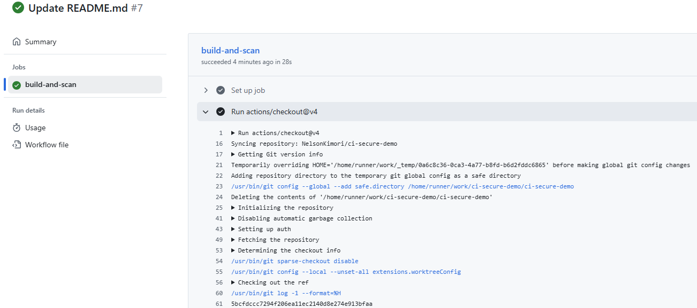
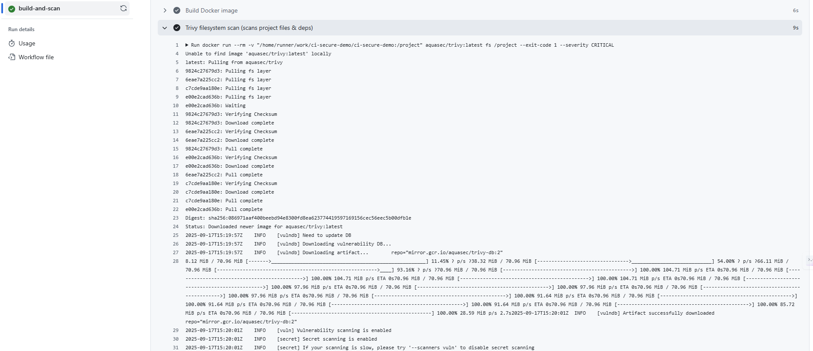

[](https://github.com/NelsonKimori/ci-secure-demo/actions/workflows/ci-security.yml)
[](https://opensource.org/licenses/MIT)
# CI / Secure Demo

> **Mini case study:** a small demo app + CI pipeline focused on integrating automated security checks (npm audit + Trivy) so vulnerable packages and container images are caught during CI.

---

## Screenshot



---

## Summary

A compact demo that shows how to add security gates into a CI process for a Node app packaged as a Docker image. The pipeline runs linting, tests, `npm audit`, builds a Docker image and scans it with Trivy. The workflow fails the run when high/critical issues are found.

## Tools / Tech

* Node.js (app)
* Docker (container image)
* GitHub Actions (CI)
* Trivy (image scanning)
* `npm audit` (dependency scanning)
* Optional: OWASP Dependency-Check

## Challenge

Prevent vulnerable dependencies and insecure container images from being merged/deployed — detect issues early in CI and fail the build on high/critical findings.

## Solution (what I did)

1. Added a GitHub Actions workflow that runs on `push` and `pull_request`.
2. Runs linting and unit tests to ensure baseline code quality.
3. Runs `npm audit` and fails the job when vulnerabilities exceed a configured severity.
4. Builds a Docker image (locally in runner) and scans it with Trivy; Trivy is configured to exit non-zero when `HIGH` or `CRITICAL` vulnerabilities are present.
5. Documented the steps, screenshots and how-to run locally in this README.

## Result / Impact

* Vulnerabilities are detected before merge.
* The pipeline enforces a security gate to avoid shipping vulnerable images.
* Demonstrates DevSecOps best-practice: shift-left security in CI.

---

## How to run locally (quick)

```bash
# clone
git clone https://github.com/NelsonKimori/ci-secure-demo.git
cd ci-secure-demo

# install dependencies
npm ci

# run lint and tests
npm run lint
npm test

# build the docker image (optional)
docker build -t ci-secure-demo:local .

# run Trivy (if installed locally)
trivy image --exit-code 1 --severity HIGH,CRITICAL ci-secure-demo:local
```

> Note: if you don't have Trivy installed, see [https://github.com/aquasecurity/trivy](https://github.com/aquasecurity/trivy) (or install via your package manager).

---

## CI (what the workflow does)

* Checkout code
* Install Node and dependencies
* Lint
* Run tests
* Run `npm audit` and fail on high/critical
* Build Docker image
* Run Trivy to scan image and fail on high/critical

The workflow file lives in `.github/workflows/ci-security.yml` (or similar).

---

## Files of interest

* `Dockerfile` — how the image is built
* `.github/workflows/ci-security.yml` — CI workflow
* `images/` — screenshots used in README
* `README.md` — this file

---

## How to reproduce the security gate

1. Push a branch with a package that has a known high severity (or temporarily tweak `npm audit` rules) and open a PR.
2. CI should run and the job will fail on `npm audit` or Trivy scan with high/critical findings.

---

## Contributing

Contributions are welcome — open an issue or PR for suggestions. Keep changes small and provide a clear description of the improvement.

---

## License

This repository is released under the **MIT License**. See `LICENSE` for details.

---

## Contact

Nelson Kimori Nyarondia — [kimorinelson@gmail.com](mailto:kimorinelson@gmail.com)

---

*Last updated:* 2025-01-17
